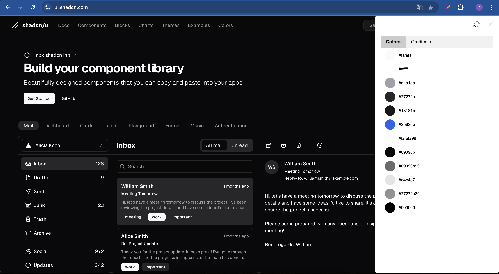

# Page Color Extractor

## Description

Page Color Extractor is a Chrome extension that extracts and displays the main colors from the current webpage. It sorts the colors by usage frequency and allows users to copy the color values in hexadecimal format.

## New Sidebar Interface
### popup

### sidebar

The extension now uses a sidebar interface instead of a popup. This new design provides a more spacious and convenient way to view and interact with the extracted colors.

## Installation

1. Clone the repository or download the source code.
2. Open Chrome and navigate to `chrome://extensions/`.
3. Enable "Developer mode" in the top right corner.
4. Click on "Load unpacked" and select the directory where the extension files are located.
5. The extension should now be visible in your Chrome toolbar.

## Usage

1. Click on the Page Color Extractor icon in the Chrome toolbar.
2. The sidebar will slide out from the right side of the browser window.
3. The extension will automatically extract colors from the current webpage.
4. You can click the refresh button in the top right corner of the sidebar to re-extract colors if the page content changes.
5. Click on any color sample to copy its hexadecimal value to the clipboard.
6. Use the tabs to switch between solid colors and gradients.
7. Click the close button in the top right corner to hide the sidebar.

## License

This project is licensed under the MIT License. See the [LICENSE](LICENSE) file for details.
