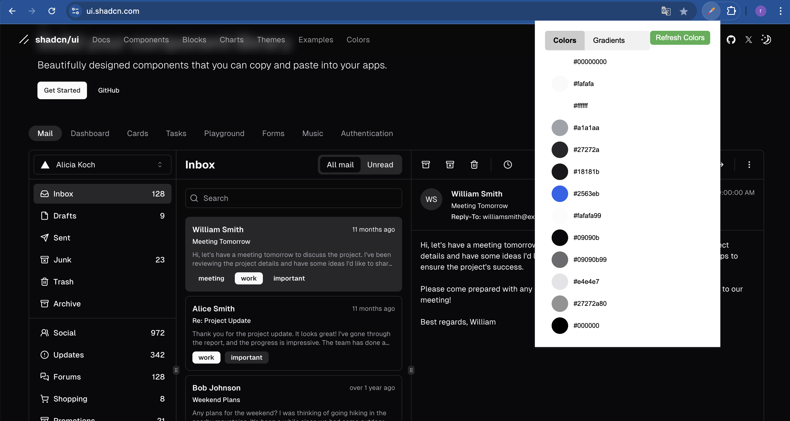

# Page Color Extractor

## Description

Page Color Extractor is a Chrome extension that extracts and displays the main colors from the current webpage. It sorts the colors by usage frequency and allows users to copy the color values in hexadecimal format.

